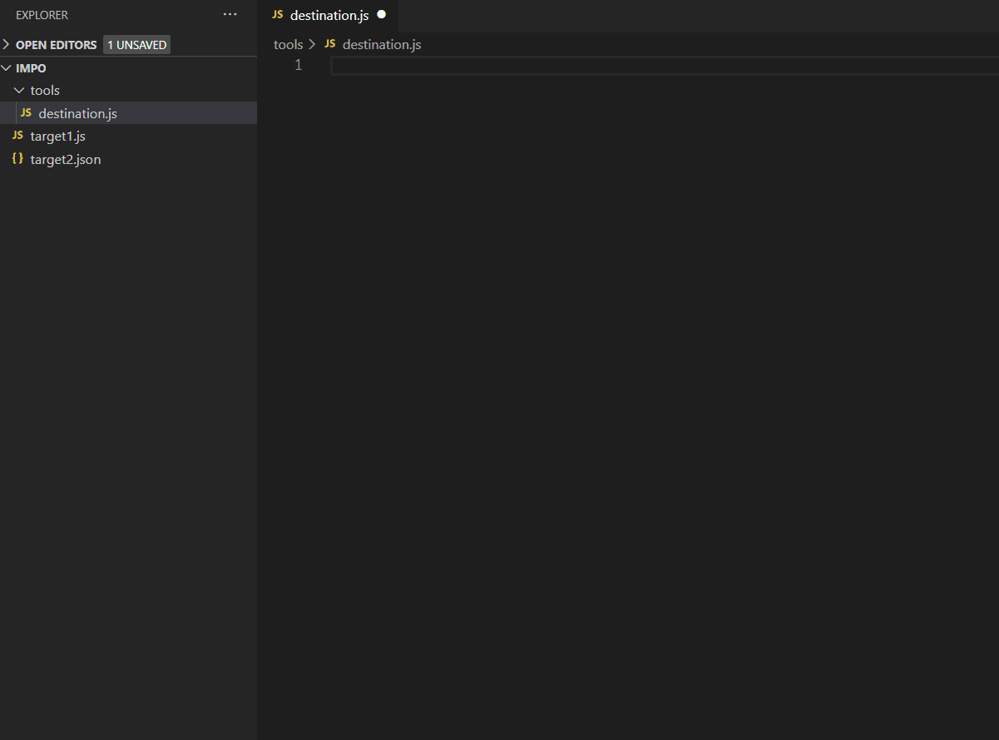

# JS Import Picker for Visual Studio Code

Typing relative paths to import in a large project eventually becomes tiresome, thats where this extension becomes handy. 
You can simply search and pick a js/json/jsx file to import using ES6 or Commonjs import syntax



**Commonjs and custom extensions**

create a file called "js-importer.json" in main directory of project

this is how options should look like
```json
{
 "type": "commonjs", 
 "extensions": "jsm,tsx" 
}
```
type defaults to - "es6"
extesions defaults to - "js,json,jsx"